```
source .venv/bin/activate
```

```
deactivate
```

## Bibtex

If you find this code useful in your research, please cite:

```
MDM:

@inproceedings{
tevet2023human,
title={Human Motion Diffusion Model},
author={Guy Tevet and Sigal Raab and Brian Gordon and Yoni Shafir and Daniel Cohen-or and Amit Haim Bermano},
booktitle={The Eleventh International Conference on Learning Representations },
year={2023},
url={https://openreview.net/forum?id=SJ1kSyO2jwu}
}

DiP and CLoSD:

@article{tevet2024closd,
  title={CLoSD: Closing the Loop between Simulation and Diffusion for multi-task character control},
  author={Tevet, Guy and Raab, Sigal and Cohan, Setareh and Reda, Daniele and Luo, Zhengyi and Peng, Xue Bin and Bermano, Amit H and van de Panne, Michiel},
  journal={arXiv preprint arXiv:2410.03441},
  year={2024}
}
```


## Getting started

This code was tested on `Ubuntu 18.04.5 LTS` and requires:

* Python 3.7
* UV (recommended) or conda3/miniconda3
* CUDA capable GPU (one is enough)

### 1. Setup environment

Install ffmpeg (if not already installed):

```shell
sudo apt update
sudo apt install ffmpeg
```
For windows use [this](https://www.geeksforgeeks.org/how-to-install-ffmpeg-on-windows/) instead.

#### Option A: Using UV (Recommended - Faster)

```shell
# Install UV if not already installed
curl -LsSf https://astral.sh/uv/install.sh | sh
source $HOME/.cargo/env

# Run the setup script
bash setup_uv.sh

# Activate the environment
source .venv/bin/activate
```

#### Option B: Using Conda (Original)

```shell
conda env create -f environment.yml
conda activate mdm
python -m spacy download en_core_web_sm
pip install git+https://github.com/openai/CLIP.git
```
#### Generate from test set prompts

#shell
#python -m sample.generate --model_path ./save/humanml_trans_enc_512/model000200000.pt --num_samples 10 #--num_repetitions 3


```shell
python -m sample.generate --model_path /home/skr/motion-diffusion-model/save/humanml_enc_512_50steps/model000750000.pt --num_samples 10 --num_repetitions 3
```

```shell 
python -m sample.generate --model_path /home/skr/motion-diffusion-model/save/humanml_enc_512_50steps/model000750000.pt --input_text ./assets/example_text_prompts.txt


```shell 
python -m sample.generate --model_path /home/skr/motion-diffusion-model/save/humanml_enc_512_50steps/model000750000.pt --input_text ./assets/example_text_prompts.txt
```
#### Generate from your text file

```shell
#python -m sample.generate --model_path ./save/humanml_trans_enc_512/model000200000.pt --input_text ./assets/#example_text_prompts.txt
```

```shell
python -m sample.generate --model_path /home/skr/motion-diffusion-model/save/humanml_enc_512_50steps/model000750000.pt --input_text ./assets/example_text_prompts.txt
```

#### Generate a single prompt

```shell
python -m sample.generate --model_path ./save/humanml_trans_enc_512/model000200000.pt --text_prompt "the person walked forward and is picking up his toolbox."
```

```shell
python -m sample.generate --model_path /home/skr/motion-diffusion-model/save/humanml_enc_512_50steps/model000750000.pt --text_prompt "the person walked forward and is picking up his toolbox."
```

### Action to Motion

#### Generate from test set actions

```shell
python -m sample.generate --model_path ./save/humanact12/model000350000.pt --num_samples 10 --num_repetitions 3
```

#### Generate from your actions file

```shell
python -m sample.generate --model_path ./save/humanact12/model000350000.pt --action_file ./assets/example_action_names_humanact12.txt
```

#### Generate a single action

```shell
python -m sample.generate --model_path ./save/humanact12/model000350000.pt --action_name "drink"
```

### Unconstrained

```shell
python -m sample.generate --model_path ./save/unconstrained/model000450000.pt --num_samples 10 --num_repetitions 3
```

By abuse of notation, (num_samples * num_repetitions) samples are created, and are visually organized in a display of num_samples rows and num_repetitions columns.

**You may also define:**
* `--device` id.
* `--seed` to sample different prompts.
* `--motion_length` (text-to-motion only) in seconds (maximum is 9.8[sec]).

**Running those will get you:**

* `results.npy` file with text prompts and xyz positions of the generated animation
* `sample##_rep##.mp4` - a stick figure animation for each generated motion.

It will look something like this:


You can stop here, or render the SMPL mesh using the following script.

### Render SMPL mesh

To create SMPL mesh per frame run:

```shell
python -m visualize.render_mesh --input_path /path/to/mp4/stick/figure/file
```
### Unconditioned editing

```shell
python -m sample.edit --model_path ./save/humanml_trans_enc_512/model000200000.pt --edit_mode in_between
```

**You may also define:**
* `--num_samples` (default is 10) / `--num_repetitions` (default is 3).
* `--device` id.
* `--seed` to sample different prompts.
* `--edit_mode upper_body` For upper body editing (lower body is fixed).


The output will look like this (blue frames are from the input motion; orange were generated by the model):


* As in *Motion Synthesis*, you may follow the **Render SMPL mesh** section to obtain meshes for your edited motions.

### Text conditioned editing

Just add the text conditioning using `--text_condition`. For example:

```shell
python -m sample.edit --model_path ./save/humanml_trans_enc_512/model000200000.pt --edit_mode upper_body --text_condition "A person throws a ball"
```

The output will look like this (blue joints are from the input motion; orange were generated by the model):


## Train your own MDM

### Text to Motion

**HumanML3D**

To reproduce the original paper model, run:

```shell
python -m train.train_mdm --save_dir save/my_humanml_trans_enc_512 --dataset humanml
```

To reproduce MDM-50 steps, Run:

```shell
python -m train.train_mdm --save_dir save/my_humanml_trans_enc_512_50steps --dataset humanml --diffusion_steps 50 --mask_frames --use_ema
```

To reproduce MDM+DistilBERT, Run:

```shell
python -m train.train_mdm --save_dir save/my_humanml_trans_dec_bert_512 --dataset humanml --diffusion_steps 50 --arch trans_dec --text_encoder_type bert --mask_frames --use_ema
```


**KIT**
```shell
python -m train.train_mdm --save_dir save/my_kit_trans_enc_512 --dataset kit
```
### Action to Motion

```shell
python -m train.train_mdm --save_dir save/my_name --dataset {humanact12,uestc} --cond_mask_prob 0 --lambda_rcxyz 1 --lambda_vel 1 --lambda_fc 1
```

### Unconstrained

```shell
python -m train.train_mdm --save_dir save/my_name --dataset humanact12 --cond_mask_prob 0 --lambda_rcxyz 1 --lambda_vel 1 --lambda_fc 1  --unconstrained
```

## Evaluate

### Text to Motion

<!-- * Takes about 20 hours (on a single GPU) -->
* The output of this script for the pre-trained models (as was reported in the paper) is provided in the checkpoints zip file.

**HumanML3D**
```shell
python -m eval.eval_humanml --model_path ./save/humanml_trans_enc_512/model000475000.pt
```

**KIT**
```shell
python -m eval.eval_humanml --model_path ./save/kit_trans_enc_512/model000400000.pt
```

### Action to Motion

* Takes about 7 hours for UESTC and 2 hours for HumanAct12 (on a single GPU)
* The output of this script for the pre-trained models (as was reported in the paper) is provided in the checkpoints zip file.

```shell
python -m eval.eval_humanact12_uestc --model <path-to-model-ckpt> --eval_mode full
```
where `path-to-model-ckpt` can be a path to any of the pretrained action-to-motion models listed above, or to a checkpoint trained by the user.


### Unconstrained

* Takes about 3 hours (on a single GPU)

```shell
python -m eval.eval_humanact12_uestc --model ./save/unconstrained/model000450000.pt --eval_mode full
```

Precision and recall are not computed to save computing time. If you wish to compute them, edit the file eval/a2m/gru_eval.py and change the string `fast=True` to `fast=False`.

## Generated Motion Samples (GIF Files)

This repository includes high-quality GIF samples generated using different MDM model variants. All samples are converted from MP4 to GIF format while maintaining original resolution (900px width) and frame rate (20 fps) for optimal quality.

### Sample GIF Files Location
📁 **Directory:** `/home/skr/motion-diffusion-model/gif_files/`

### Model Variants and Generated Samples

#### 1. BERT Text Encoder Model
**Model:** `humanml_trans_dec_512_bert` (50 diffusion steps)  
**Location:** `gif_files/bert/`

**Samples 0-2:**
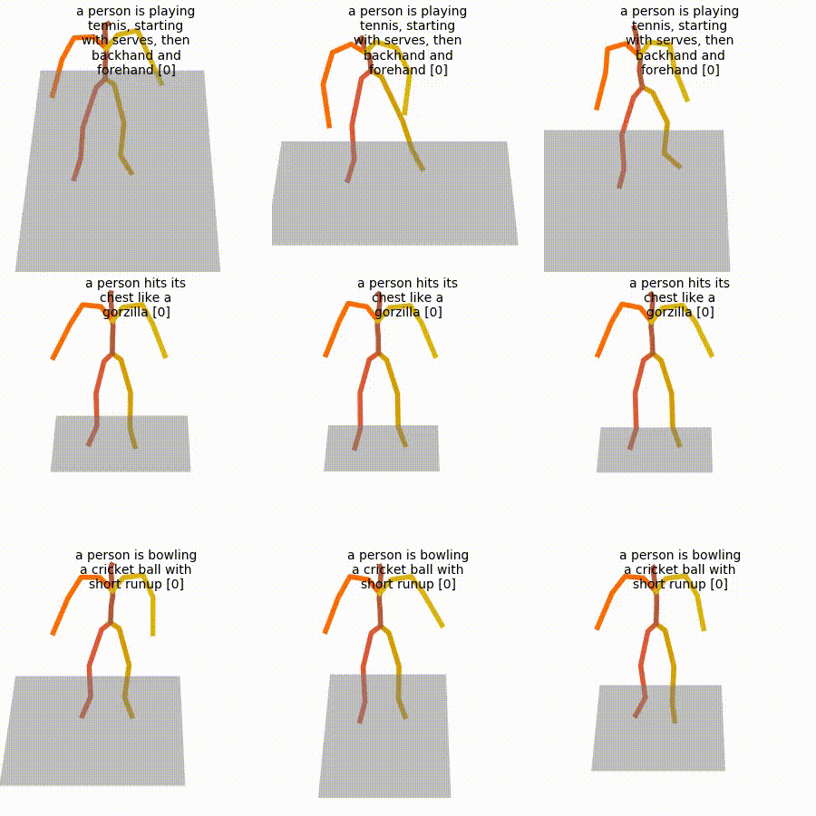

**Samples 3-5:**
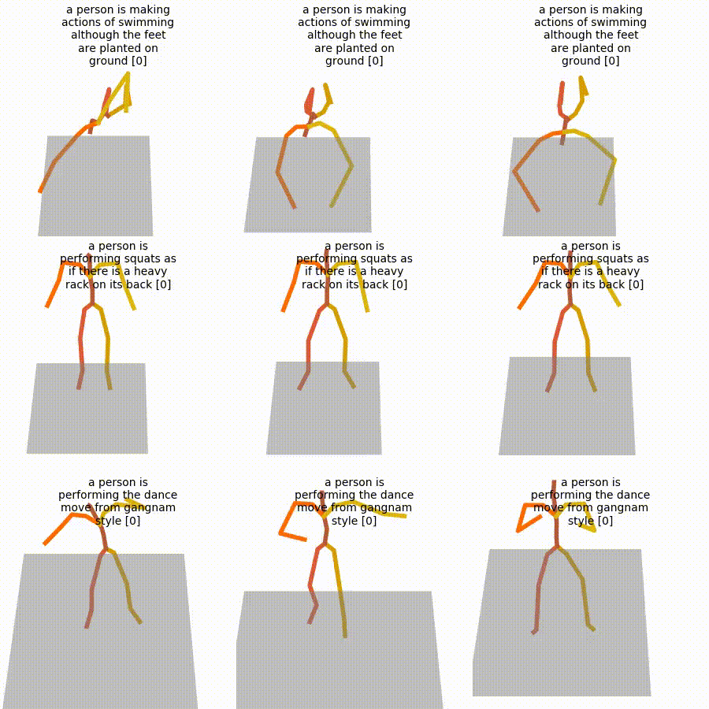

**Sample 6:**
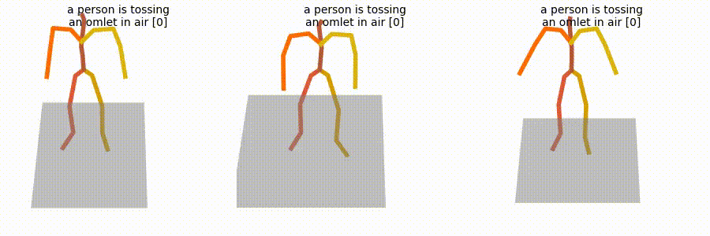

#### 2. HumanML Encoder Model (50 Steps)
**Model:** `humanml_enc_512_50steps` (50 diffusion steps, 20X faster)  
**Location:** `gif_files/humanml_enc_512_50steps/`

**Output 1:**

Samples 0-2:
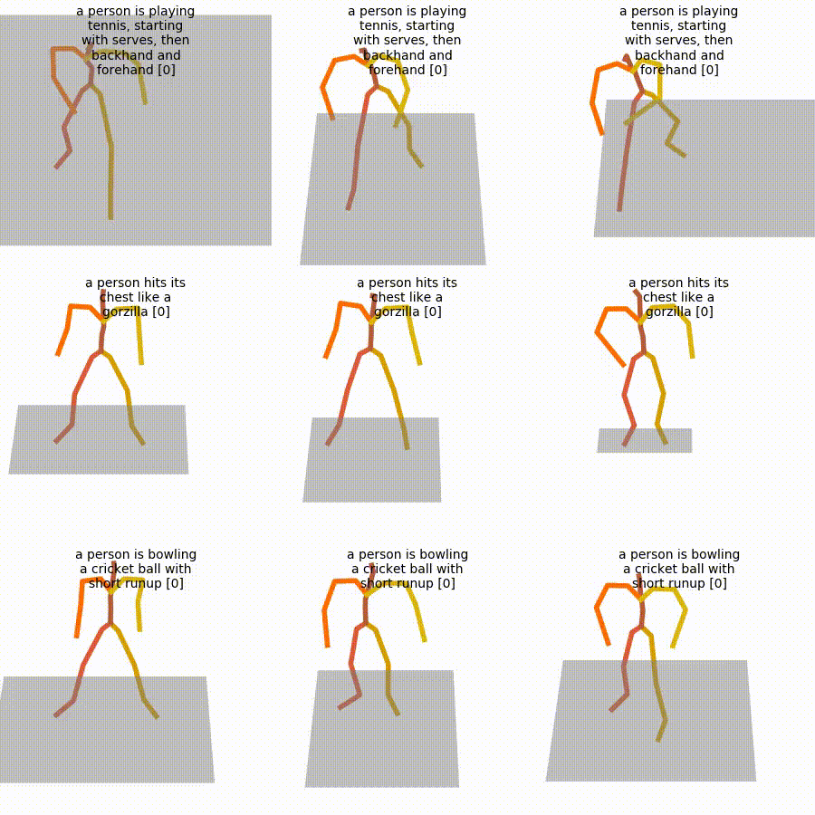

Samples 3-5:


Sample 6:
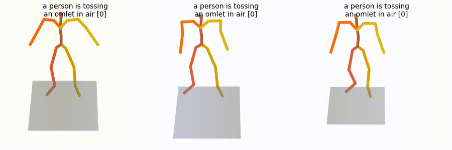

**Output 2:**

Samples 0-2:
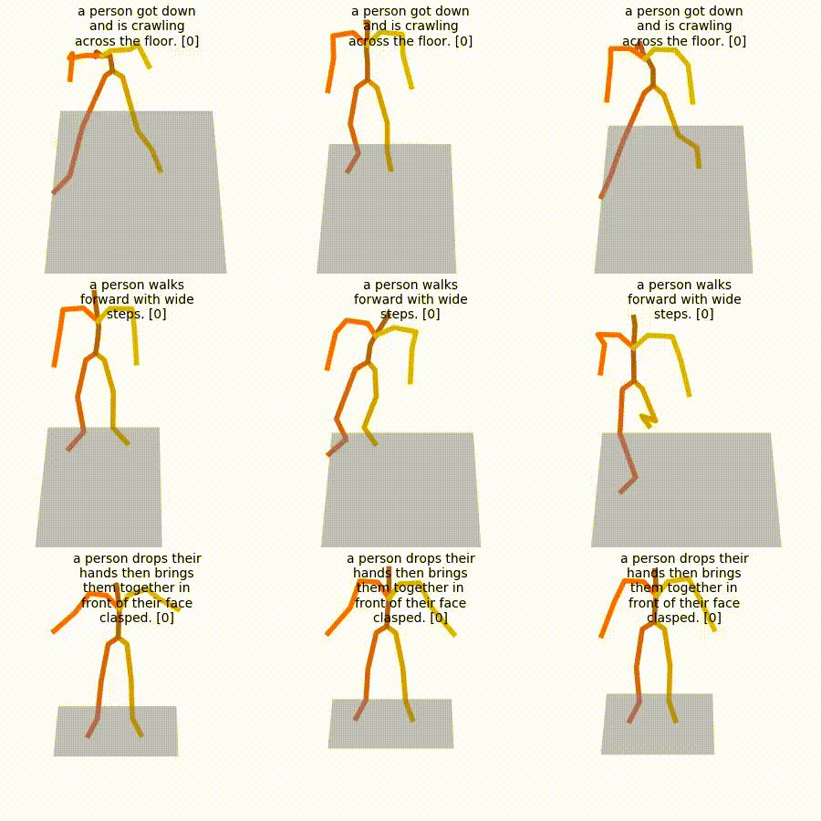

Samples 3-5:
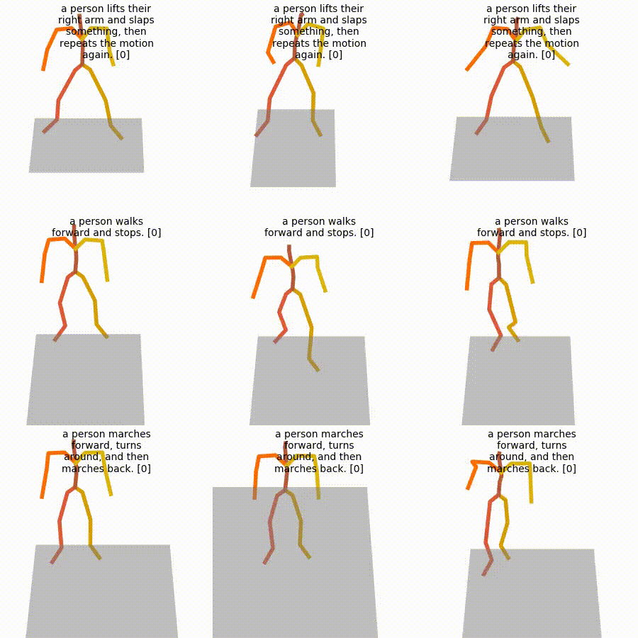

Samples 6-7:
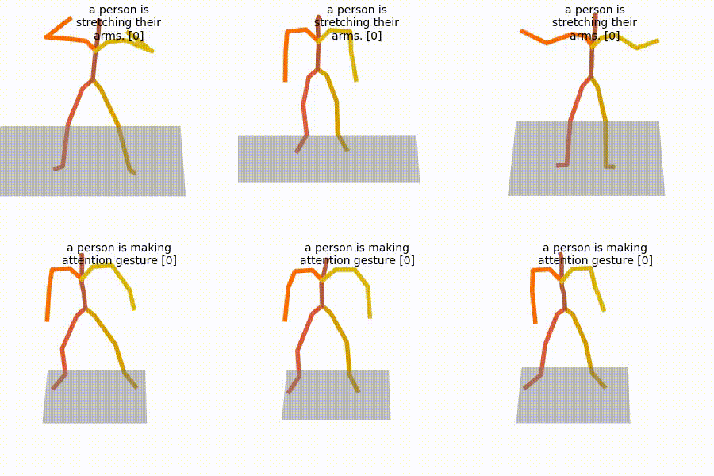

#### 3. HumanML Transformer Encoder Model
**Model:** `humanml_trans_enc_512` (original paper model)  
**Location:** `gif_files/humanml_trans_enc_512/`

**Output 1:**

Samples 0-2:
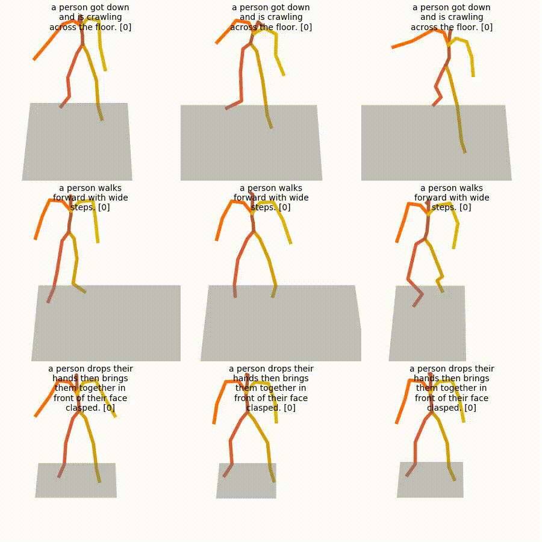

Samples 3-5:
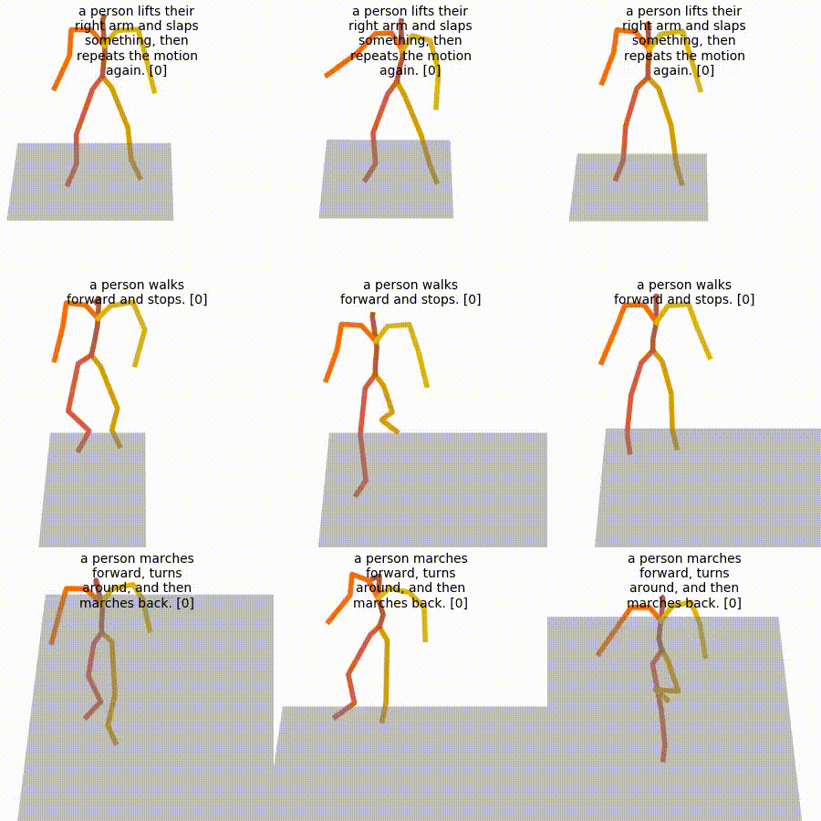

Samples 6-7:
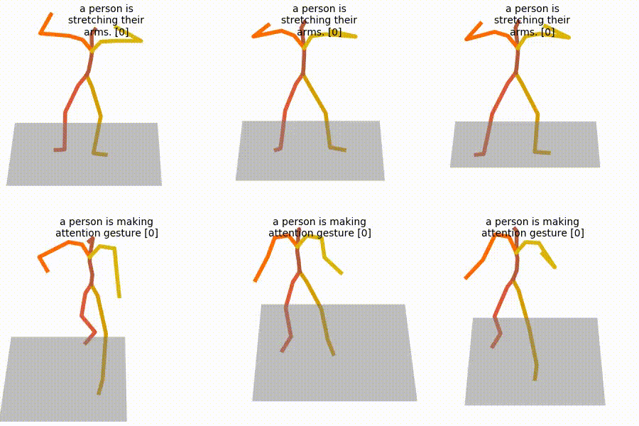

**Output 2:**

Samples 0-2:


Samples 3-5:


Sample 6:
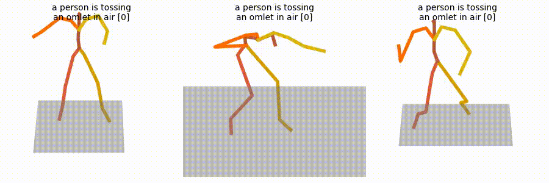

### Technical Details
- **Total Samples:** 15 GIF files
- **Resolution:** 900px width (maintains aspect ratio)
- **Frame Rate:** 20 fps (original MP4 frame rate)
- **Quality:** High-quality conversion with no compression artifacts
- **Format:** GIF with infinite loop for web compatibility

### Usage
These GIF files can be used for:
- Visualizing model performance across different architectures
- Comparing motion quality between model variants
- Documentation and presentation purposes
- Web embedding and sharing
